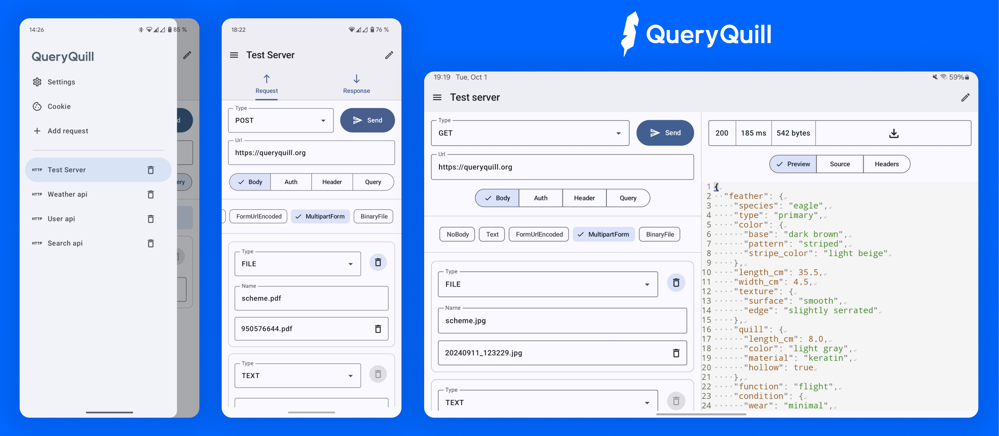
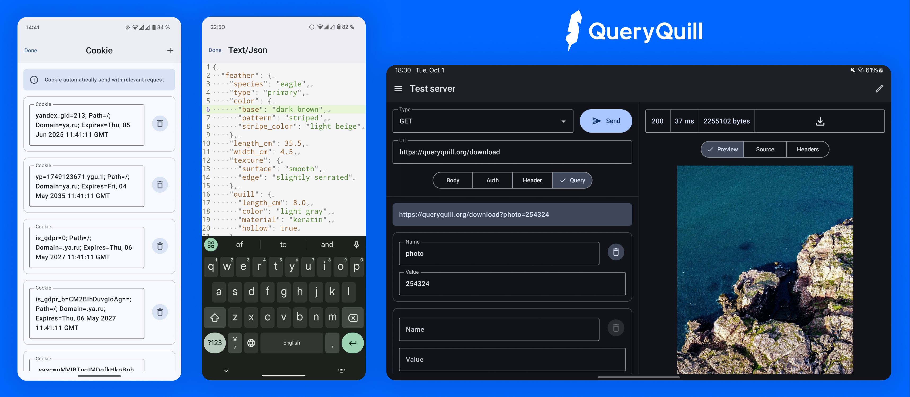

# QueryQuill

**QueryQuill** is a modern, flexible, and extensible open-source Android app that turns your device into a full-fledged API-testing tool. Now everything you need is at your fingertips—anytime, anywhere.

## Key Features

### Instant Request Setup
- **HTTP Method Selection**  
  Choose GET, POST, PUT, DELETE, and more  
- **URL Input**  
  Enter the endpoint with just a few taps  
- **Headers & Query Parameters**  
  Add, edit and organize both headers and query parameters  
- **Interactive UI**  
  Effortlessly manage headers and parameters in a visual editor  

### Smart Request Body Handling
- **Four Built-In Body Types**  
  - Text  
  - Form URL-Encoded  
  - Multipart Form  
  - Binary File  
- **Auto-Detection**  
  Automatically detects the body type and applies the correct `Content-Type` header  
- **File Uploads**  
  Send files from internal or external storage directly in your requests  

### Authentication Templates
- Preconfigured templates for common auth schemes

### Cookie Management
- **Auto-Capture & Storage**  
  Cookies are saved automatically after each response  
- **Session Switching**  
  Toggle between multiple cookie jars for different sessions  

### History & Multitasking
- **Full Request History**  
  Quickly access and resend past requests  
- **Tabbed Interface**  
  Work with multiple requests side by side  

### Convenient Response Viewer
- **Syntax Highlighting**  
  JSON and XML are colorized for better readability  
- **Metadata Display**  
  View HTTP status, headers, and timing information  
- **Preview Mode**  
  Render HTML, images, video, and other media types in-app  
- **Raw Response & Download**  
  Inspect the raw response or download the body to your device  

QueryQuill brings together all the tools you need for comprehensive API testing—right on your Android device.  

# Screenshots

## Roadmap

1. **Full Test Coverage**  
   – Implement comprehensive unit, integration, and UI tests across all modules  

2. **WebSocket Testing**  
   – Add support for opening, sending, and receiving messages over WebSocket connections  
   – Provide interactive UI for defining message payloads and viewing real-time responses  

3. **GraphQL Support**  
   – Enable crafting and sending GraphQL queries and mutations  
   – Syntax highlighting and schema introspection for better query authoring  

4. **cURL Import/Export**  
   – Allow importing requests directly from cURL command lines  
   – Export any saved request as a ready-to-use cURL command 

## Technology Stack

- Jetpack Compose  
- Kotlin  
- MVI 
- Koin  
- Coil  
- Room  
- DataStore Preferences  
- Ktor  
- Sora Editor  
- Kotlinx Serialization  
- Navigation Compose  
- Material3  

---
